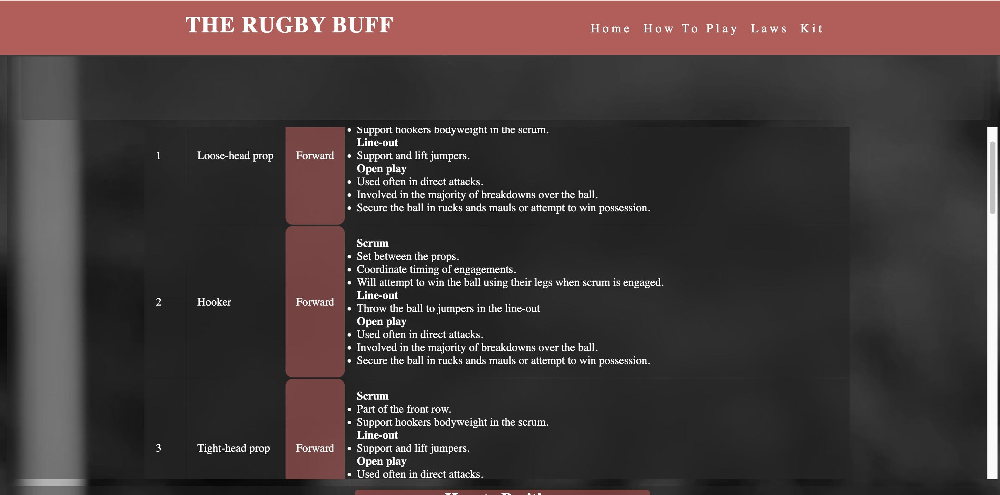

# The Rugby Buff

## OVERVIEW

The Rugby Buff

The rugby buff is a basic site to learn about standard rugby union. When learning a new sport as a player or a spectator, common questions about the game are asked. “What’s happening and why” being chief among them. Without going into intricate detail and confusing the user, this site will only cover the roles of players and officials. Giving a basic understanding of the pitch and the rules and laws that form the sport. So as to not include too much detail the site will act as a sign post to the up to date laws and regulations of the sport.

## FEATURES

 ### Existing features
 - **Navigation Bar** 
    - This is used on all four pages to allow the user to easily move through the site.
    

- **Footer**
   - This section includes social media links. Each link open to a new page as its makes it easier for the user when sent to an external site.
      
 - **Home page**
   - History section- Brief history about the sport and how rugby was invented. 

   - Tournaments section- Naming three popular tournaments including international teams.

   - Teams section- this includes a table that lists the top 10 world ranking teams in 2024.

- **How to play page**
   - Pitch section- this section uses bird-eye view images of the pitch to help a user identify and understand the pitch markings. 

   - Positions- this section uses numbered icons positioned in a common game scenario to help the user differentiate between forwards and back. following the image is a table clearly highlighting the positions names and roles within the team. 

   - How to position- similar to the pitch section, birds-eye view of the pitch and icons showing how the attacking and defending team will be positioned. 

   - Scenarios- this section uses images of players in game scenarios to give an example of what they would look like.

   - Overflow scroll bar, this giving the user the option view aspects of the table and allowing them to move through the page easily. 

  

- **Laws page**
   - Ethos section- this section briefly touches on the ethos and conduct expected of players. It also uses an image link of the World rugby site, this site cover the up to date rules and regulations of the sport in the event of law changes. 
   
   - World rugby page link

   

   - Officials section- this section briefly explains the roles of a referee and a touch-judge. 

   - Card System- this section explains the how and why a referee might give a player a red or yellow card.

- **Kit page**

   - Players gear and equipment section- this uses a brief description of the kit and equipment used in a game and images as examples of each item.

- **The footer**
   - This section includes social media links. Each link open to a new page as its makes it easier for the user when sent to an external site.

### Features left to implement 

-**Javascript**
   - To implement a carousel effect on image groups and reduce the amount of space used for images. 
   - Quiz section at the end of each page would need a scripting language like javascript and make all pages more interactive

- **Coaching page**
   - To layout attacking and defending strategies teams can us to gain the advantage. 

- **Video section**
   - Video tutorials for set pieces and open play scenarios. 

## DESIGN  

Home page
  

How to play page
  

Laws
  

Kit

  

## TESTING

### Contents

- [Functional Testing](#functional-testing)
- [Validator Testing](#validator-testing)
  - [HTML](#html)
  - [CSS](#css)
- [WAVE](#wave)
- [LightHouse](#lighthouse)
- [Browser Compatibility](#browser-compatibility)
- [Responsiveness](#responsivity)
- [Issues/ Bugs Found & Resolved](#issues-bugs)
- [Unresolved](#unresolved)

### Functional Testing

---

| Page       | Test                                                                                   | Completed successfully |
| :--------- | :------------------------------------------------------------------------------------- | :--------------------: |
| All        | Navigation links to relevant pages                                                     |          Yes           |
| All        | Hover effect  show faint white outline over sections                                                             |          Yes           |
| All  | Images and text are responsive to device size                                                      |          Yes           |
| Laws  | World rugby image takes user to the World rugby laws page when clicked                           |          Yes           |        
| All       | Images                                   |          Yes           |

**Navigation Links**

| Navigation Link | Page to Load  | Completed |
|-----------------|---------------|-----------|
| The Rugby BUFF      |  index.html    |   Yes     |
| Home   |  index.html   |   Yes     |
| How to play     |  how-to-play.html    |   Yes     |
| Laws  |  laws.html   |   Yes     |
| Kit    |  kit.html    |   Yes     |
| World rugby image  |  World rugby laws page  |   Yes     |
| Facebook  icon |  Facebook login page  |   Yes     |
| Instagram  icon|  Instagram login page  |   Yes     |
| Youtube  icon | Youtube login page  |   Yes     |

### HTML

[W3C Markup Validator](https://validator.w3.org/)

- No errors were returned when passing through the official W3S validator

Result

Home Page

How to play page

Laws page 

Kit page 

### CSS 

[W3C CSS Validator](https://jigsaw.w3.org/css-validator/)

This test returned no errors.
Results for the CSS:

Result

- Home page

How to play page

Laws page

Kit page

## WAVE

---

[WAVE](https://wave.webaim.org/)

Accessibility standards were checked using WAVE WebAIM

Result

One error was registered by WAVE WebAIM, this was due to an empty form label in the navigation bar. as the navigation bar is included in all pages the same error occurred on all ages. as this label is used for the burger icon, there is no need for the label to contain content for the label to function as expected.

Testing was focused to ensure the following criteria were met:

- Colour contrasts meets acceptable ratio
- Importance of content is relayed correctly through header levels.
- All not textual content had alternative text or titles.
- HTML page lang attribute has been set.
- Aria properties have been implemented correctly.

## LightHouse

---

Lighthouse was accessed through Developer Tools in Chrome and used to analyse:

- Performance
- Accessibility
- Best practice
- SEO

Homepage

How to play page

Laws

Kit

## Browser Compatibility

---

This website was tested on Chrome and Safari for desktop. The website was also tested on Safari for an iPhone and iPad, Macbook 

## Responsiveness 

---

### Responsiveness

All pages were tested to ensure responsiveness on screen sizes from 375px and upwards.

Responsiveness was tested through Chrome Developer tools. The devices tested include:

- iPhone SE
- iPhone XR
- iPhone 12 Pro
- iPhone 14 Pro Max
- Pixel 7
- Samsung Galaxy S8+
- Samsung Galaxy S20 Ultra
- iPad Mini
- iPad Air
- iPad Pro
- Surface Pro 7
- Surface Duo
- Galaxy Z Fold 5
- Asus Zenbook Fold
- Samsung Galaxy A51/71
- Nest Hub
- Nest Hub Max

I was able to directly test the website on an iPhone 12, iPad 12 , Macbook and an HP M22f (21.5") screen .

Steps to test:

1. Open browser and navigate to across all pages
2. Open the developer tools (right click and inspect)
3. Set to responsive and decrease width to 375px
4. Set the zoom to 92%
5.  Click and drag the responsive window to maximum width.

Results:

- The website was responsive on all screen sizes.
-  No horizontal scroll was present.
-  No elements overlapped

### Validator testing
**Html** 
   - W3C Validator 
     - No errors found

**CSS**
   - (Jigsaw) validator 
     - 1 error found

When testing responsiveness through different device sizes, all pages on the are fully responsive to suit the device size. From the navigation bar in the header to the layout of the images, sections and text. After the site was deployed, the devices used to test responsiveness were...

-  Iphone 13
-  Macbook 
-  Ipad

All pages responded as expected.

**Obstacles**
   - When testing the method of using a carousel with a hidden overflow, the images did not react as expected when using different browser. The main problem the site encountered after pushing the code was that the images would morph slightly out of shape and move outside of the sections boundaries when viewed on the Safari browser. A simple solution to this problem would be to include the use of the Javascript coding language. For this reason a simple card layout was used as it guaranteed the images were visible on all browsers and device sizes.

   - Due to the size of the assets the site began to slow down and get a low performance score on Lighthouse. to address this, all images were resized, compressed and converted to improve the sites performance.   

## DEPLOYMENT

### Deployment to Github Pages

This project was created through [GitHub](https://github.com/):

1. Locating repository, clicking on the "New" button.
2. Selecting the relevant template: "Code-Institute-Org/gitpod-full-template"
3. Adding the repository name "Punters Quiz".
4. Clicking the button "Create repository".

This project was developed using [Visual Studio Code](https://code.visualstudio.com/) and committed and pushed to GitHub using the VS-Code source control feature. Following "git commands" were used:

1. **Commit** - This command for multiple files to the staging area before pushing the code to Github.
2. **git commit -m "Message explaining update"** - Typically the message would include "docs:, style: and fix:" before the message explaining the update to clarify the nature of the commit.
3. **Push** - After committing  the changes, select the dropdown menu on the commit button and select "Push". This action sent all changes to the Github repository. 

This project was deployed from its Github repository to Github Pages:

1. Log in to Github account
2. From the projects repository selecting "Settings" tab.
3. Click on "Pages" from the left-hand menu
4. The "Source" box must state "Deploy from branch"
5. Under "Branch", click the dropdown named "None" and select "main".
6. Click save.
7. After a few seconds, refresh the page and retrieve the link.

### Clone the Repository Code Locally

Navigate to the GitHub Repository you want to clone to use locally:

- Click on the code drop down button
- Click on HTTPS
- Copy the repository link to the clipboard
- Open your IDE of choice (git must be installed for the next steps)
- Type git clone copied-git-url into the IDE terminal
- The project will now have been cloned on your local machine for use.

**CONTENT**
* Content for all pages was from <a href="https://www.world.rugby/" target="about_blank">World rugby</a> and the Rugby Football Union website. 
* Icons in the footer were taken from <a href="https://fontawesome.com/" target="about_blank">Fontawesome</a>.
* <a href="" target="about_blank">Favicon </a>was created using Flatiron and Procreate.
* CSS-Tricks Orientation lock 

**MEDIA**
Images were taken from <a href="https://www.pexels.com/" target="about_blank">Pexels</a> and edited using <a href="https://procreate.com/" target="about_blank">Procreate</a> to better suit the website. 

